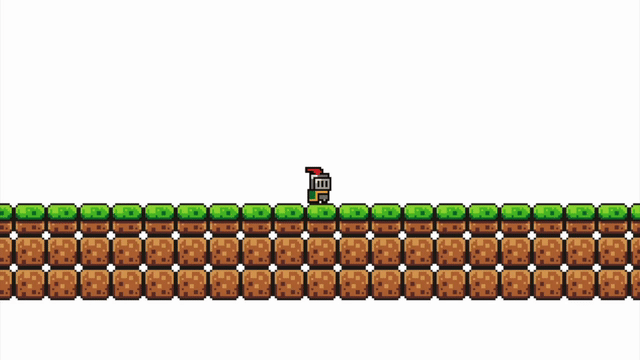

# Fruit Knight

Fruit Knight is a 2D platformer game written in Java 21 using the [Processing](https://processing.org/) library.

<p align="center">
  
</p>

## Objective

Collect all fruits as fast as possible. A level contains only one fruit, which transports the player to the next level. Collecting the fruit on the last level stops the timer and presents the score.

## Getting Started

**Requirements:** Java 21

The game can be built with [Gradle](https://gradle.org/).

```bash
./gradlew run
```

Or, on Windows:

```cmd
gradlew.bat run
```

### Building a JAR

The project can be compiled into a standalone JAR using the [Shadow](https://plugins.gradle.org/plugin/com.gradleup.shadow) plugin:

```bash
./gradlew shadowJar
```

The output `fruit-knight.jar` will be located in build/libs directory.

## Controls

| Key | Action |
|-----|--------|
| A / D | Move left / right |
| Space / W | Jump |
| N | Next level |
| P | Previous level |
| R | Reset |
| T | Toggle debug mode |
| E | Toggle edit mode |
| O | Create a new level (edit) |
| L | Save changes (edit) |


## Edit Mode

Pressing `E` pauses the game and opens the level editor. From there you can:

- Place (Left Click) entities.
- Remove (Right Click) entities.
- Create a new level (O).
- Save changes to the current level (L).

Level data is stored as JSON files.

New levels will be subsequently named: "1.json", "2.json", ...

## Features

- Physics - Gravity, friction and velocity clamping.
- Collision - Manually implemented Axis-Aligned Bounding Box collision system.
- Camera - Smooth follow camera for gameplay and an edit camera with pan and zoom.
- Timer - Tracking total time elapsed in gameplay, timer stops and resumes upon toggling the edit mode.
- Animations - Directional idle and running animations for the player.
- Quick Reset - Game automatically resets the player, when the sprite falls off, however manual reset can be triggered upon pressing R.
- Editable levels - levels can be edited during the game, no need to use another application externally.

## Roadmap

Scripting engine — ability to write player instructions in Python-like code, interpreted and executed within the game loop, allowing high-level code to control the player.

## Resources

- [Processing](https://processing.org/) — graphics library used for rendering
- [Brackey's Platformer Bundle](https://brackeysgames.itch.io/brackeys-platformer-bundle) - textures and sprites
